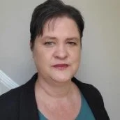
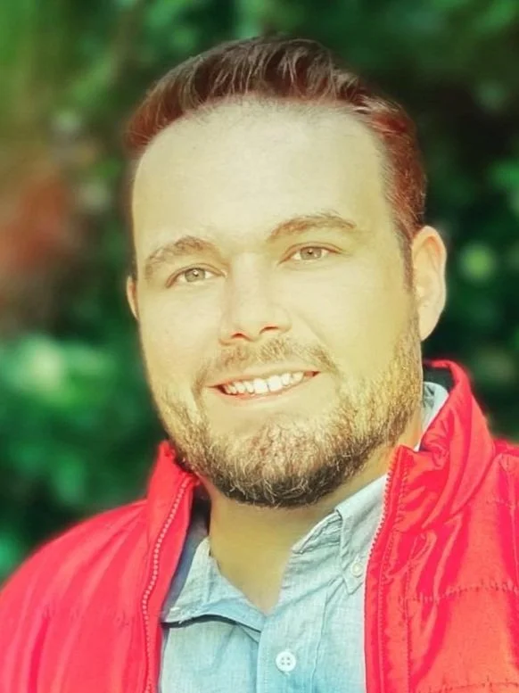
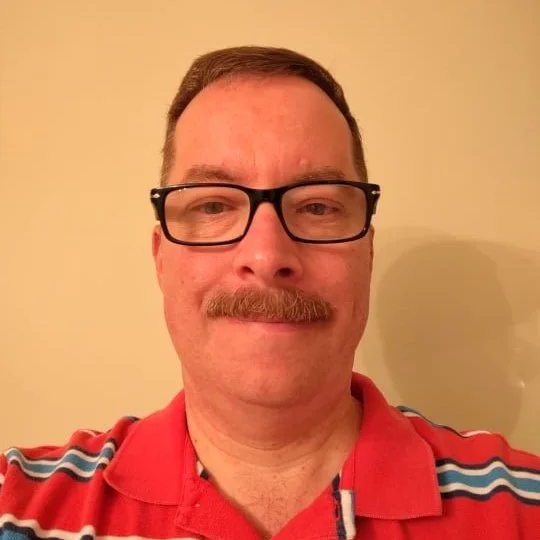
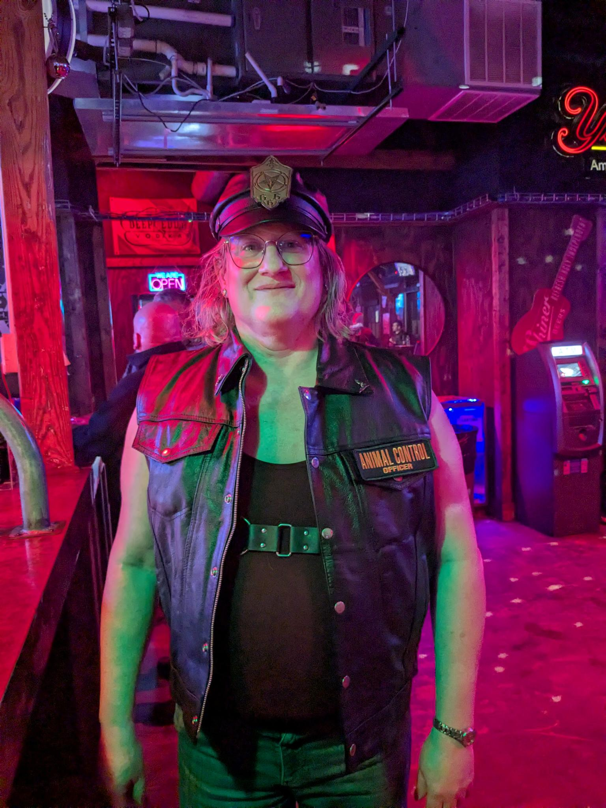
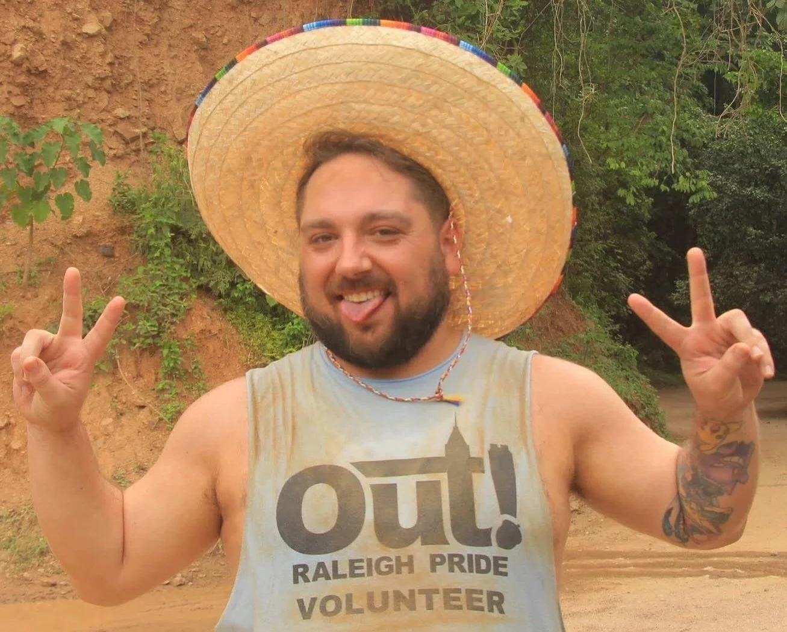

+++
title = "Our Team & About Us"
+++

# About Us

We are the Wake County chapter of the 
[LGBTQ+ Democrats of North Carolina](https://www.lgbtqdemocrats.org/).

The LGBTQ+ Democrats of Wake County works within the Wake County 
Democratic Party, to provide a strong voice and representation for 
LGBTQ+ people.  Our goal is to secure fully equal rights for all 
LGBTQ+ citizens through effective legislation and policies, to elect 
pro-equality Democrats to office, and encourage LGBTQ+ people to 
participate fully as Democrats at all levels of policy making and 
public service.

We are **NOT**:

* An activist group.
* A gathering point for counties within the unorganized regional group as defined by the
  [LGBTQ+ Democrats of North Carolina](https://www.lgbtqdemocrats.org/).
* A useful voice for municipalities that sprawl beyond Wake County

# Meet Our Board

## Brandi Brown, President (she/her)

Brandi works in progressive politics as an organizer. She got her 
start in LGBTQ+ activism when she helped planned the first Pride 
event in Macon, Georgia. Since then, she has worked with a variety of 
causes and organizations. She managed the campaign of the first openly
transgender woman to run for office in North Carolina - and remains 
hopeful for the day we will be able to break that barrier.  She 
previously served as our chapter Vice President, currently is area 
coordinator for Knightdale, and a member of the State Executive 
Committee.

## Codi Viars-Whisinnand, Vice President (he/him)

Cody helps lead efforts to mobilize voters, support LGBTQ+ 
candidates, and advance inclusive policy. He also represents his 
community on the State Executive Committee of the North Carolina 
Democratic Party and chairs Precinct 01-38 (Brentwood Neighborhood) 
in Raleigh.

Professionally, Cody is a marketing analyst who specializes in using 
data and insights to drive strategic communications and 
decision-making. With experience across industries including 
commerce, data analytics and AI, research and development, and 
healthcare, he brings a fact-based, results-oriented approach to 
every initiative. He is especially passionate about elevating 
marginalized voices and believes in the power of collaboration to 
create lasting change. Cody lives in Raleigh with his husband and 
their two dogs.

### Secretary (vacant)

We currently have two openings on our Board, one for Secretary and 
another for a Member-at-Large. If you’re interested in getting 
involved in either role, please reach out to us at 
[admin@lgbtqdemsofwake.com](mailto:admin@lgbtqdemsofwake.com)!

### Rich Elkins, Treasurer/Member at-Large (he/him)

Rich’s Democratic and LGBTQ+ activism goes back to his college days 
in the early 90s when he was an officer with the NCSU College Dems, 
then at ECU when he started the LGBTQ+ Student organization on campus
there. Over the years, his focus would switch between the two until 
becoming a charter member of the LGBTQ+ Democrats of NC, where he 
served as 3rd District Chair until moving to Raleigh in 2016. He 
served as our Chapter President from 2021-24 and currently serves as 
a Precinct Chair in East Raleigh, WCDP Assistant Parliamentarian, and
a member of the SEC.

### Katie Day, Member at-Large (they/she)

Katie is a geek, singer, writer, and chaos goblin that recently 
turned to politics.  She shares blame for 'alt.transgendered', the 
first public open online forum for trans folks on USENET in 1992.  

They became visible and heard in the Raleigh/Durham/Chapel Hill kink,
queer, and punk community when they began transition as a non-binary 
trans femme in 2022.  Their transition brought them into social 
circles where they saw the stark challenges for service labor, the 
impoverished, the unhoused, the unfed, and the disabled.  

She saw voices within her social circles were not heard by local 
politicians nor the local party.  Their fumbling to bring those 
voices to elected officials led to involvement in party and activist 
groups.  

She is comfortable talking to elected officials that campaigned on 
erasing the existence of the marginalized and building relationships 
to elected officials that are allies.  They are comfortable talking 
to conservative parents about keeping a trans child surving and 
thriving.  She's comfortable digging through public data to make the 
slog suck less.  

### Chase Franklin, Member At-Large (he/him)

Chase Franklin is a proud working-class progressive, precinct chair, 
and member of the State Executive Committee. An elder millennial with
a geeky streak, Chase is passionate about building power from the 
ground up—both in the community and at the ballot box.

They’ve worked in web and software development and are currently on 
the job hunt for their next role in tech—while holding it down at a 
local sub shop. Outside of organizing and coding, you’ll find Chase 
playing softball and pickleball, dancing like nobody’s watching, or 
holding the point in Overwatch with a well-timed Moira fade or sneaky
Sombra flank.

With a partner of nearly seven years and a deep commitment to social 
justice, Chase believes in taking bold, unapologetic action to push 
back against the rising tide of fascism and fight for a future rooted
in equity and dignity. Their focus includes campaign finance reform,
tackling wealth inequality, ending gerrymandering, curbing corporate 
lobbying, and fiercely defending the rights of our most vulnerable — 
especially our trans siblings.

Whether showing up for their neighbors or shutting down ultimates in 
overtime, Chase brings the same energy: principled, passionate, and 
ready to fight for a better world.

## Que Vapne, Member At-Large (get pronouns)

Request Biography from Que

# Documents

* [County Chapter Bylaws](Bylaws_Revised_2024_-_LGBTQ\+_Democrats_of_Wake_County_Bylaws.pdf)
  * [Country Chapter Bylaws on Google Drive](https://drive.google.com/file/d/1bm_9X3SXXj2Bjb88kUg1WYgHecI6s2H5/view)
* [State Bylaws](lgbtqplusdemocratsnc_bylaws.pdf)
  * [State ByLaws from Their Content Management System](https://e5cb46e8-3a57-4d81-9fa6-d6354ff497d5.filesusr.com/ugd/dff851_37c9c4cb9d0b48bf8bddffecfd0487e8.pdf)
* [Meeting Minutes](quoth_the_server_404)
