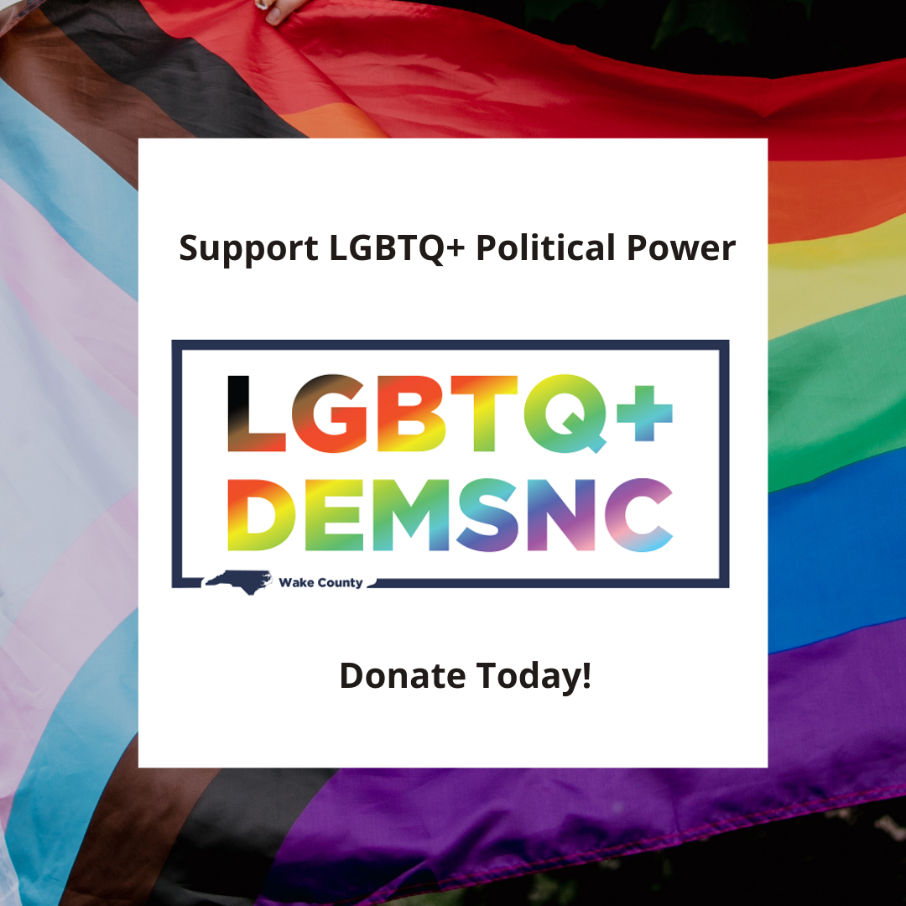
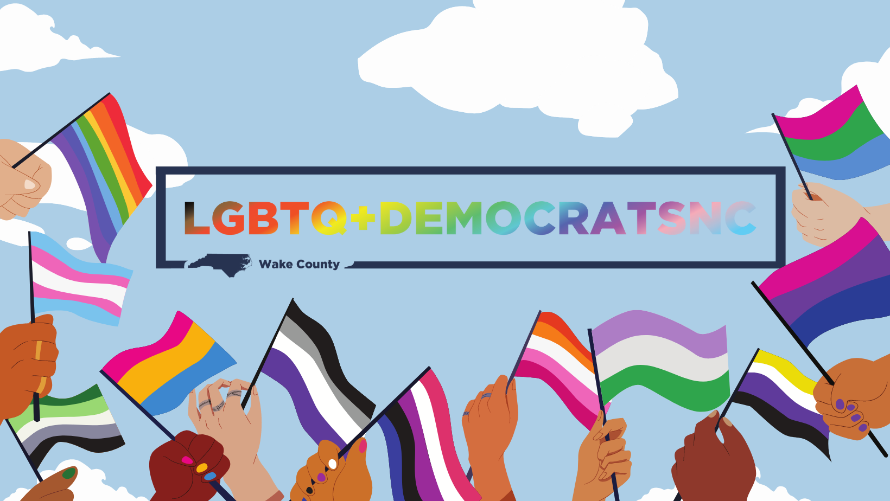

+++
title = "Join or Donate"
+++

We need your help to elect more pro-equality Democrats! Please become
a member or consider making a donation to support our work. 
Membership is limited to registered Democrats in Wake County, but 
others are encouraged to participate and/or donate.

## [Annual Membership Fee $30:](https://secure.actblue.com/donate/lgbtqwakemembershipdues2020?amount=%7B95962%3A25%2C42435%3A5%7D)

Includes your state dues. $25 comes to our chapter to support our 
work, and $5 goes to the state organization.

Additional donations in excess of regular membership appreciated.

## [Reduced dues option:](https://secure.actblue.com/donate/lgbtqwake-reduced?amount=%7B95962%3A10%2C42435%3A5%7D)

Reduced dues option: For individuals with income limitations which 
would be a barrier to joining, we have a reduced annual membership 
option of $15, which still covers your state dues. No verification is
needed and this is not a separate category of membership.

## [General One-Time or Monthly Donation option:](https://secure.actblue.com/donate/lgbtqwakedonate)

If you’d like to make a donation to our efforts without joining or in
addition to your membership, this form allows for one-time or 
recurring monthly contributions which are greatly appreciated!

## Participation in our events is open to members and non-members alike. 

While formal membership along with privileges of serving on the 
Board or voting as a member are limited to those who are registered 
Democrats in Wake County, we invite and encourage general 
participation from those who aren’t registered as Democrats or who do
not reside in Wake County.

Live in another county? We may have a chapter there, or you can join 
our State Organization as an at-large member from any other county. 

Check out [LGBTQ+ Democrats of North Carolina](https://www.lgbtqdemocrats.org/) for membership options 
and locations of other chapters!

